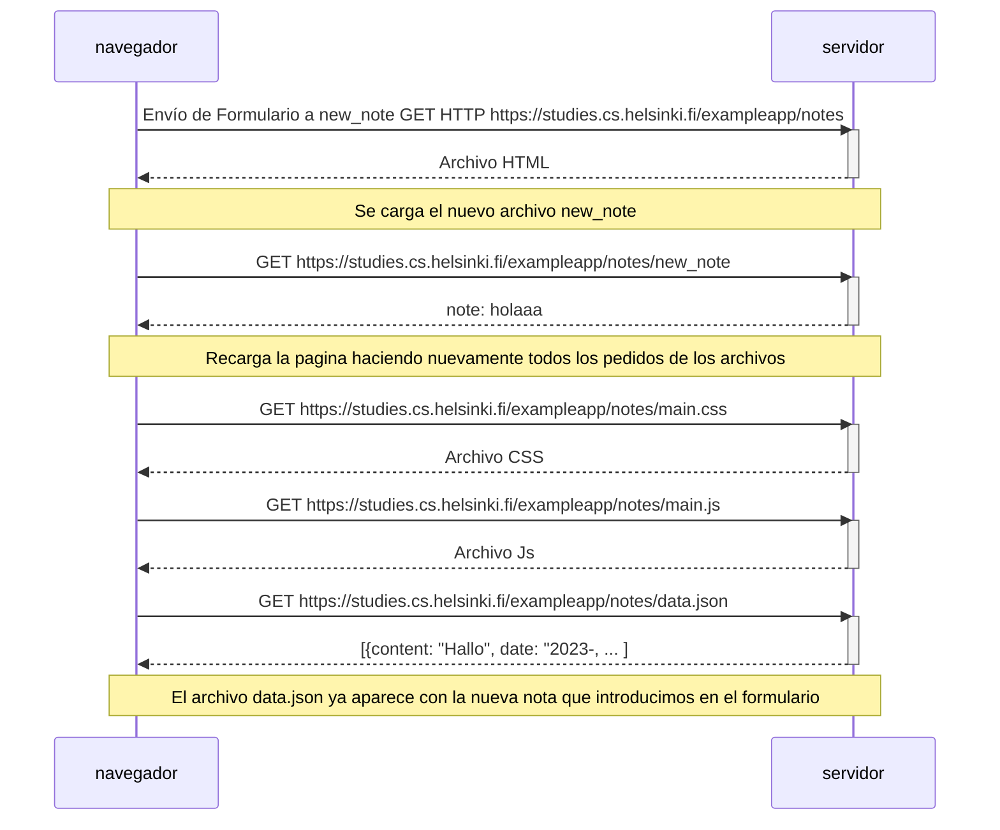

# Ejercicio 0.4
Diagrama de la secuencia en la creación de una nota en [notes](https://studies.cs.helsinki.fi/exampleapp/notes)

```mermaid
  sequenceDiagram
    participant navegador
    participant servidor

    navegador->>servidor: Envío de Formulario a new_note GET HTTP https://studies.cs.helsinki.fi/exampleapp/notes
    activate servidor
    servidor-->>navegador: Archivo HTML
    deactivate servidor

    Note over navegador,servidor: Se carga el nuevo archivo new_note
    navegador->>servidor: GET https://studies.cs.helsinki.fi/exampleapp/notes/new_note
    activate servidor
    servidor-->>navegador: note: holaaa
    deactivate servidor

    Note over navegador,servidor: Recarga la pagina haciendo nuevamente todos los pedidos de los archivos

    navegador->>servidor: GET https://studies.cs.helsinki.fi/exampleapp/notes/main.css
    activate servidor
    servidor-->>navegador: Archivo CSS
    deactivate servidor

    navegador->>servidor: GET https://studies.cs.helsinki.fi/exampleapp/notes/main.js
    activate servidor
    servidor-->>navegador: Archivo Js
    deactivate servidor

    navegador->>servidor: GET https://studies.cs.helsinki.fi/exampleapp/notes/data.json
    activate servidor
    servidor-->>navegador: [{content: "Hallo", date: "2023-, ... ]
    deactivate servidor

     Note over navegador,servidor: El archivo data.json ya aparece con la nueva nota que introducimos en el formulario

```
