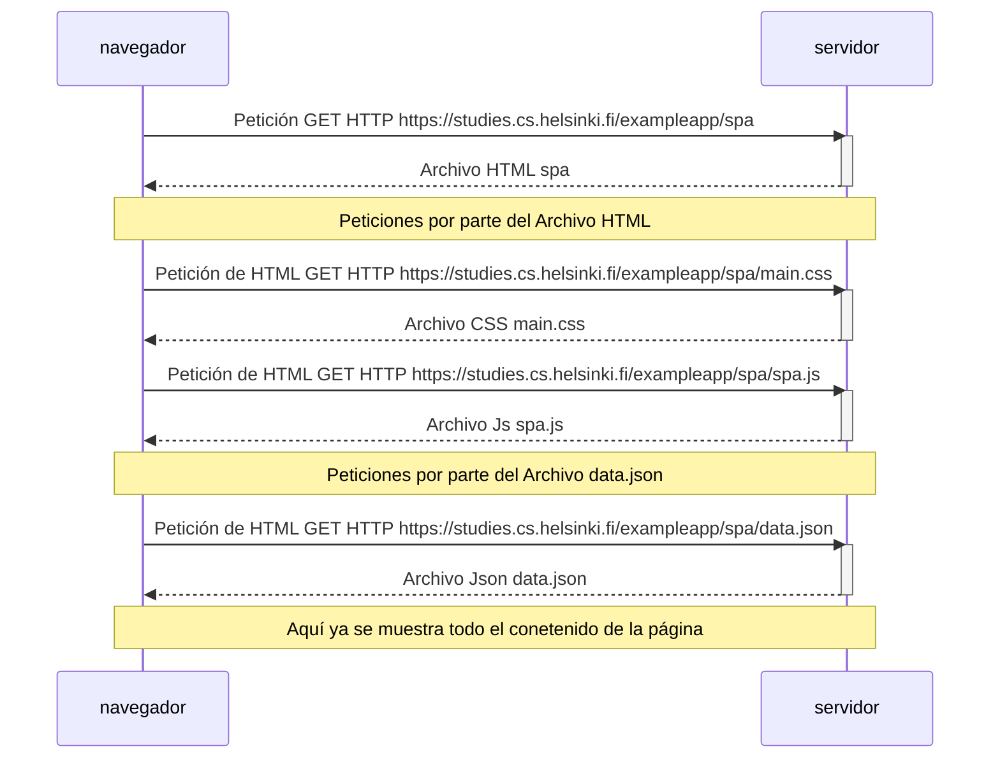

# Ejercicio 0.5
Diagrama de la secuencia en la aplicación de una sola página [spa](https://studies.cs.helsinki.fi/exampleapp/spa) cuando entra el usuario
por primera vez

```mermaid
  sequenceDiagram
    participant navegador
    participant servidor

    navegador->>servidor: Petición GET HTTP https://studies.cs.helsinki.fi/exampleapp/spa
    activate servidor
    servidor-->>navegador: Archivo HTML spa
    deactivate servidor

    Note over navegador,servidor: Peticiones por parte del Archivo HTML

    navegador->>servidor: Petición de HTML GET HTTP https://studies.cs.helsinki.fi/exampleapp/spa/main.css
    activate servidor
    servidor-->>navegador: Archivo CSS main.css
    deactivate servidor

    navegador->>servidor: Petición de HTML GET HTTP https://studies.cs.helsinki.fi/exampleapp/spa/spa.js
    activate servidor
    servidor-->>navegador: Archivo Js spa.js
    deactivate servidor

    Note over navegador,servidor: Peticiones por parte del Archivo data.json

    navegador->>servidor: Petición de HTML GET HTTP https://studies.cs.helsinki.fi/exampleapp/spa/data.json
    activate servidor
    servidor-->>navegador: Archivo Json data.json
    deactivate servidor

    Note over navegador,servidor: Aquí ya se muestra todo el conetenido de la página
```
