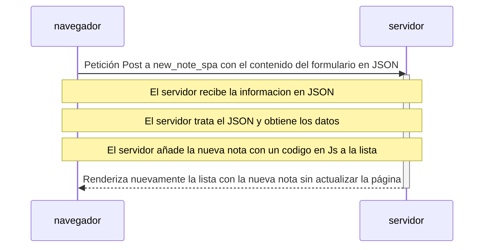

# Ejercicio 0.5
Diagrama de la secuencia de una nueva nota en la pagina [spa](https://studies.cs.helsinki.fi/exampleapp/spa)

```mermaid
  sequenceDiagram
    participant navegador
    participant servidor

    navegador->>servidor: Petición Post a new_note_spa con el contenido del formulario en JSON
    activate servidor
    Note over navegador,servidor: El servidor recibe la informacion en JSON
    Note over navegador,servidor: El servidor trata el JSON y obtiene los datos
    Note over navegador,servidor: El servidor añade la nueva nota con un codigo en Js a la lista
    servidor-->>navegador: Renderiza nuevamente la lista con la nueva nota sin actualizar la página
    deactivate servidor

```
